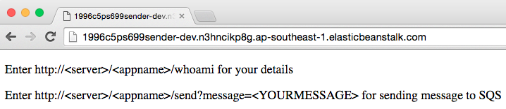
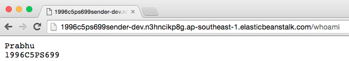
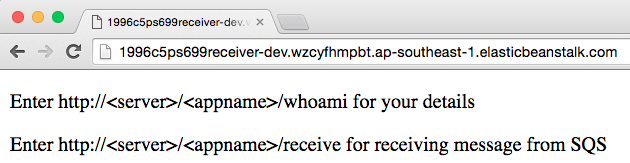
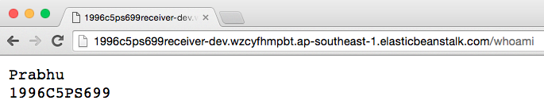
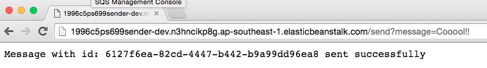
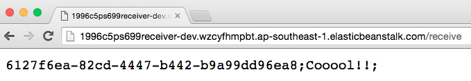

= Code for ECIII

[abstract]
Read the instructions carefully.

== Application A; (Sender); 

* Code for Sender is available in _Sender_ folder
* Make changes to the following files only

----
AWSCredentials.properties +
whoami.txt +
web.xml
----

* _AWSCredentials.properties_ present in _src_ folder will contain your accesskey and secretid.
* _whoami.txt_ present in _WebContent_ folder will have your name and BITS idnumber
* _web.xml_ present in _WebContent/WEB-INF_ folder will have the following configuration.

[source,xml]
----
 <servlet>
    <description></description>
    <display-name>SenderServlet</display-name>
    <servlet-name>SenderServlet</servlet-name>
    <servlet-class>com.ec3.SenderServlet</servlet-class>
    <init-param>
        <param-name>SQSDetailsEndPoint</param-name>
        <param-value>YOUR SQS ENDPOINT GOES HERE</param-value>
    </init-param>
  </servlet>
----

* You need to replace _YOUR SQS ENDPOINT GOES HERE_ in _<param-value>_ element with your SQS Endpoint.

== Application B; (Receiver); Java WEB

* Code for Receiver is available in _Receiver_ folder
* Make changes to the following files only

----
AWSCredentials.properties +
whoami.txt +
web.xml
----

* _AWSCredentials.properties_ present in _src_ folder will contain your accesskey and secretid.
* _whoami.txt_ present in _WebContent_ folder will have your name and BITS idnumber
* _web.xml_ present in _WebContent/WEB-INF_ folder will have the following configuration.

[source,xml]
----
<servlet>
    <description></description>
    <display-name>ReceiverServlet</display-name>
    <servlet-name>ReceiverServlet</servlet-name>
    <servlet-class>com.ec3.ReceiverServlet</servlet-class>
    <init-param>
      <param-name>SQSDetailsEndPoint</param-name>
      <param-value>YOUR SQS ENDPOINT GOES HERE</param-value>
    </init-param>
  </servlet>
----
* You need to replace _YOUR SQS ENDPOINT GOES HERE_ in _<param-value>_ element with your SQS Endpoint.

== SQS

* You need to create a SQS Queue that allows Send,Receive and View messages operations only to the following two account numbers

* Your Account NUMBER
* 871443587426 (This is my account number)

* I will validate viewing the messages using another account number I have and SQS should deny permission. Failing this, you will lose 2 marks

== Sample Screen shots after SQS is configured and applications are deployed in EB

*  *Please ignore some minor formatting issues.*

== Running Sender
 +

===  Running whoami of Sender
 +

== Running Receiver
 +

===  Running whoami of Receiver
 +

=== The send-receive operation
 +
 +
